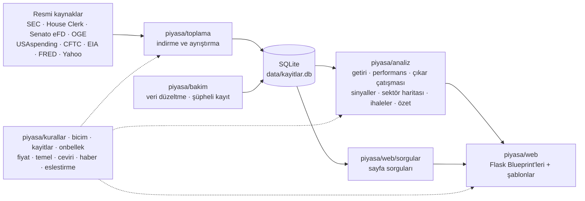

# Piyasa Kaydı

ABD'deki resmi mali bildirimleri Türkçeleştirip okunur hale getiren bir
şeffaflık sitesi: Kongre üyelerinin, Başkan ve Başkan Yardımcısının, şirket
yöneticilerinin hisse işlemleri; büyük fon ve bankaların portföyleri;
emtialar ve bunlar üzerine istatistiksel analizler.

Veriler resmi kaynaklardan çekilir (SEC EDGAR, House Clerk, OGE, CFTC, EIA,
FRED). Her kaydın yanında kaynak belgeye bağlantı vardır.

**Bu sitede yatırım tavsiyesi verilmez.** Yalnızca kamuya açık bildirimler
derlenir ve gösterilir.

## Ne gösteriyor

**Yönetici işlemleri (Form 4)**
Şirket yöneticileri ve %10'un üzerindeki ortaklar, hisse alım satımlarını
SEC'e bildirmek zorunda. Site yalnızca açık piyasa işlemlerini gösterir;
maaş kapsamında verilen hisseler ve opsiyon kullanımları listeye dahil
edilmez.

Her kayıtta işlem tarihi, bildirim tarihi ve aradaki **bildirim gecikmesi**
görünür.

**Fon ve banka pozisyonları (13F)**
100 milyon doların üzerinde varlık yöneten kurumlar, çeyreklik olarak
portföylerini bildirir. Site 49 büyük kurumu (Vanguard, BlackRock, State
Street, JPMorgan, Berkshire, Norveç Varlık Fonu…) takip eder; çeyrekler
arası farkı hesaplayarak hangi hisseye girildiğini, hangisinden çıkıldığını
ve pozisyon değişimlerini gösterir.

**Siyasetçiler**
Temsilciler Meclisi üyelerinin STOCK Act işlem bildirimleri (House Clerk PDF'leri
ayrıştırılarak), resmi fotoğraflar, liderlik görevleri ve komiteler. Her
üyenin tahmini portföyü (alıp satmadığı hisseler) dairesel grafikle gösterilir.
Başkan ve Başkan Yardımcısının OGE yıllık bildiriminden hisse/fon portföyü ve
yıl içindeki işlemleri ayıklanır (tahvil ve şirket payları elenerek).

**Emtialar**
Altın, gümüş, platin, bakır ve Brent petrol:
güncel fiyat, 1 gün – 10 yıl değişimler, hacim; büyük fonların net pozisyonu
(CFTC), ABD ham petrol stokları (EIA), Fed faiz kararları ve tahvil
faizleri (FRED), konuya göre etiketlenmiş Türkçe haberler (Google Haberler).
Altın sayfasında gram altının TL fiyatı da hesaplanır.

**Analizler**
- *Kim piyasayı yendi?* — Kongre üyelerinin aldığı hisselerin alımdan 90 gün
  sonra S&P 500'e göre durumu; üye üye sıralama, satış isabeti ve “bildirimden
  sonra alan biri” karşılaştırması.
- *Çıkar çatışması* — üyelerin, komitelerinin denetlediği sektörden (SEC sanayi
  kodlarına göre) yaptığı işlemler.
- *Üçlü onay* — yöneticilerin, siyasetçilerin ve fonların birlikte aldığı hisseler.
- *Sinyaller işe yarıyor mu?* — siyasetçi, yüklü, çıkar çatışmalı, yönetici ve
  küme alımlarının 30/90/180 gün sonraki endekse göre getirisi; güven aralığı,
  t testi ve çoklu karşılaştırma (Holm) düzeltmesiyle.
- *Günlük özet* — günün bildirimlerinden kural tabanlı Türkçe özet; veri her
  sabah otomatik güncellenir.

## Kurulum

```bash
git clone https://github.com/cemgokmen/piyasa-kaydi.git
cd piyasa-kaydi

python3 -m venv venv
source venv/bin/activate        # Windows: venv\Scripts\activate

pip install -r requirements.txt
python -m piyasa veritabani
```

`veritabani` komutu tabloları oluşturur; eski bir veritabanında eksik
sütunları da ekler.

SEC, kendisine istek atan herkesin kimlik bildirmesini istiyor. Kendi adını
ve e-posta adresini ortam değişkeniyle ver:

```bash
export SEC_USER_AGENT="PiyasaKaydi ad@ornek.com"
```

Varsayılan değer `piyasa/ayarlar.py` içinde.

## Kullanım

Bütün işler tek bir komut üzerinden yapılır. Komut listesi:
`python -m piyasa yardim`

```bash
python -m piyasa site          # siteyi başlatır → http://127.0.0.1:5001
python -m piyasa site --ag     # aynı Wi-Fi'daki telefondan açmak için (adresi yazdırır)
python -m piyasa guncelle      # bütün veriyi günceller (her adım ayrı; biri hata verse de devam eder)
python -m piyasa zamanla       # tam güncelleme her sabah 07:00, yeni bildirimler 12:00 ve 00:00 (macOS)
python -m piyasa zamanla --kaldir
```

**Yönetici işlemleri (Form 4)** — son 90 günde eksik olan günleri, en
yeniden başlayarak tamamlar. Yarıda kesilirse tekrar çalıştır, tamamlanan
günleri atlar:

```bash
python -m piyasa form4
python -m piyasa supheli
```

**Kongre üyelerinin işlemleri** — varsayılan bu yıl; yıl verilebilir.
İşlenmiş bildirimleri atlar:

```bash
python -m piyasa kongre 2025 2026
```

**Emtia verileri** — fon konumları (CFTC, haftalık), stoklar (EIA, haftalık),
faizler (FRED, günlük). Fiyatlar ve haberler site açıkken canlı alınır:

```bash
python -m piyasa emtia
```

**Analiz verisi** — işlem yapılan hisselerin fiyat geçmişi, şirket sektörleri,
Meclis komiteleri ve liderlik görevleri, Başkan ve Başkan Yardımcısının OGE
bildirimleri, işlem sonrası getiriler:

```bash
python -m piyasa sirketler
python -m piyasa yurutme
python -m piyasa fiyatlar
python -m piyasa analiz
```

**Fon pozisyonları (13F)** — çeyrekte bir yeterli. Bildirimler Şubat, Mayıs,
Ağustos ve Kasım aylarının ortasında yayımlanır:

```bash
python -m piyasa fon              # yeni çeyrekleri indirir (indirilmişleri atlar)
python -m piyasa fon --yeniden    # bütün fonları baştan indirir
python -m piyasa cusip            # CUSIP → hisse kodu (OpenFIGI)
python -m piyasa yayin            # yayın sürümü (gunicorn, sıkıştırma, sayfa önbelleği); --kur: Mac açılınca başlar
python -m piyasa profiller        # hisse sayfalarındaki "Şirket ne iş yapıyor?" kutusu
```

Takip edilen fonlar `data/fonlar.json` dosyasındadır (ad ve SEC CIK numarası).

## Testler ve kod denetimi

```bash
pip install -r requirements-dev.txt
python -m pytest
ruff check .
```

Katman kuralı: `web` yalnızca diğer katmanları kullanır; veri toplama,
analiz ve emtia katmanları `web`'i içe aktarmaz (`tests/test_mimari.py`
denetler).

Testler gerçek veritabanına ve internete dokunmaz; geçici bir örnek
veritabanı kurulur, fiyat servisi sahte veriyle değiştirilir.

- `tests/test_sayfalar.py` — her sayfa, 404'ler ve sitedeki bütün iç
  bağlantıların gezilmesi
- `tests/test_bicim.py` — tutar/tarih biçimleri, fiyat değişimi hesabı,
  Kongre bildirimi yardımcıları, haber seçimi
- `tests/test_analiz.py` — getiri hesabı, istatistik ve Holm düzeltmesi,
  sektör eşlemeleri
- `tests/test_tarayici.py` — başsız Chrome'da menüler, arama, seçim
  kutuları, sıralama, süzme, tıklanabilir satırlar, fiyat grafiği ve
  telefon görünümü. Chrome yoksa atlanır.

## Mimari



Katman kuralları:

- `toplama` yalnızca veri indirir ve veritabanına yazar; `bakim` yazılan veriyi
  düzeltir; `analiz` ve `web` yalnızca okur.
- Bağımlılık tek yönlüdür ve `tests/test_mimari.py` denetler: `web` dışındaki
  hiçbir katman `web`'i, `analiz`/`web`/`emtia` ise `toplama` ve `bakim`'ı içe
  aktarmaz; `toplama` da `bakim`'ı içe aktarmaz. Ortak sabitler `kurallar.py`'dedir.
- Alan kuralları (yasal süreler, eşikler, SQL koşulları) `kurallar.py`'de,
  Türkçe biçimlendirme `bicim.py`'de tek yerde durur.
- Canlı veriler (fiyat, haber, öneri dizini) `@sureli` önbelleğiyle tutulur.
- Bilgisayar ve telefon görünümleri ayrı stil dosyalarındadır: `mobil.css`
  yalnızca dar ekranlarda yüklenir.

## Yapı

```
app.py                     Siteyi başlatır (python app.py)
piyasa/
  __main__.py              Komut satırı: python -m piyasa <komut>
  ayarlar.py               Dosya yolları, SEC_USER_AGENT
  veritabani.py            SQLite bağlantısı ve şema (data/kayitlar.db)
  kurallar.py              Yasal süreler, eşikler, partiler, ortak SQL koşulları
  bicim.py                 Tutar, yüzde ve tarihlerin Türkçe gösterimi
  kayitlar.py              İşlem kayıtlarını gösterime hazırlama
  fiyat.py                 Yahoo Finance: anlık fiyat (1 dk) ve günlük geçmiş, değişimler, hacim
  sirket_profili.py        Şirket tanımı: elle yazılmış metin (veri/sirket_tanimlari.json) ya da çeviri
  temel.py                 Şirketin rakamları: değerleme, karlılık, bilanço, son çeyrek, analistler
  ceviri.py                Ücretsiz İngilizce → Türkçe çeviri ve çeviri sonrası düzeltmeler
  haber.py                 Google Haberler RSS (emtia ve hisse haberlerinin ortak kısmı)
  hisse_haberleri.py       Hisse sayfasındaki güncel haberler (Türkçe, gerekirse çevrilmiş İngilizce)
  yayin.py                 Yayın sürümü (gunicorn) ve Mac açılınca başlatma
  veri/                    sirket_tanimlari.json (298 şirket), endustriler.json (145 faaliyet alanı)
  onbellek.py              Süreli bellek önbelleği (@sureli)
  uyeler.py                Siyasetçi fotoğrafları, görevleri, önemli siyasetçiler
  eslestirme.py            Şirket adı → borsa kodu (SEC listesiyle, tutucu)
  zamanlama.py             Günlük otomatik güncelleme (launchd)
  slug.py                  İsimleri adres dostu metne çevirir

  toplama/                 Resmi kaynaklardan veri indirenler
    form4.py               Form 4 ayrıştırma; son iş gününü indirir
    form4_gecmis.py        Eksik günleri paralel indirir
    kongre.py              House Clerk işlem bildirimleri (PDF)
    senato.py              Senato eFD işlem raporları (görünmez Chrome ile)
    kongre_ortak.py        Meclis ve Senato toplayıcılarının ortak parçaları
    ihaleler.py            USAspending.gov devlet sözleşmeleri
    fon13f.py              Fonların 13F bildirimleri
    cusip.py               CUSIP → hisse kodu eşlemesi
    profiller.py           şirket tanımlarını önceden doldurur
    yurutme.py             Trump ve Vance'in OGE mali durum bildirimleri (liste)
    oge_yillik.py          OGE yıllık bildiriminden hisse portföyü ve işlemler
    emtia.py               CFTC fon konumları, EIA stokları, FRED faizleri
    fiyat_gecmisi.py       İşlem yapılan hisselerin ve SPY'nin günlük kapanışları
    sirketler.py           SEC sektörleri, Kongre üyeleri (Meclis ve Senato) ve komite üyelikleri
    fon_listesi.py, fon_cik.py, fon_ara.py   Fon listesi ve CIK bulma

  bakim/                   Veritabanı bakımı
    veri_duzelt.py         Borsa kodları, düzeltilmiş rapor kopyaları, eksik partiler
    supheli.py             Anormal fiyatlı ve tarihli kayıtları işaretler
    slug_ekle.py           Eski kayıtlara kişi adresi ekler
    sutun_ekle.py          Tabloları oluşturur, eksik sütunları ekler

  emtia/                   Emtialar
    tanimlar.py            Takip edilen emtialar, kodlar, birimler, etkenler
    sorgular.py            Fon konumu, stok ve faiz hesapları
    haberler.py            Türkçe haberler (Google Haberler RSS, 30 dk önbellek)
    serit.py               Üstteki piyasa şeridi (BIST 100, S&P 500, dolar/TL, altın...)

  analiz/                  Analizler
    getiri.py              İşlem sonrası getiri (30/90/180 gün, bugüne) ve SPY
    performans.py          Siyasetçilerin yatırım performansı
    portfoy.py             Siyasetçinin tahmini portföyü (alıp satmadığı hisseler)
    yurutme.py             Başkan ve Başkan Yardımcısının portföyü ve işlemleri
    cakisma.py             Komite ↔ sektör çıkar çatışmaları
    sektorler.py           SIC → sektör ve komite → sektör eşlemeleri
    sinyaller.py           Üçlü onay ve sinyallerin geçmiş başarısı
    istatistik.py          Güven aralığı, t testi, Holm düzeltmesi
    sektor_haritasi.py     Siyasetçi ve yönetici alımlarının sektörlere göre dağılımı
    ihale.py               Devlet sözleşmeleri; alımdan sonra gelen olağandışı sözleşmeler
    ozet.py                Günlük özet
    destek_direnc.py       Destek/direnç modeli (deneysel, siteye bağlı değil)
    sr_dene.py, sr_tarama.py

  web/                     Flask sitesi
    __init__.py            create_app()
    rotalar.py             Sayfalar (Blueprint); SQL içermez
    emtia_rotalari.py      Emtia sayfaları (Blueprint)
    analiz_rotalari.py     Performans, çıkar çatışması, sinyaller, günlük özet
    bicim.py               Şablon süzgeçleri
    arama.py               Arama önerileri: hisse, kişi, fon, emtia dizini
    sayfa_onbellegi.py     2 dakikalık hazır sayfa önbelleği (aynı sayfayı tek istek hazırlar)
    sorgular/              Sayfa sorguları: islemler, genel, siyaset, hisse, kisi, fonlar
    templates/, static/    Şablonlar; stil.css (ortak), mobil.css (telefon), app.js,
                           grafik.js (SVG grafik çizici), fiyat.js

tests/                     pytest testleri

deneme/                    İlk denemeler ve tek seferlik scriptler
data/                      Veritabanı ve fon listesi
```

## Destek / direnç modeli (deneysel)

`piyasa/analiz/destek_direnc.py` fiyat geçmişinden destek ve direnç bölgeleri çıkarır ve
her bölgenin geçmişte gerçekten tutunup tutunmadığını şansla karşılaştırır:
aynı seride rastgele çizilen seviyelerin tutunma oranı "şans oranı" kabul
edilir, bölgenin z-skoru buna göre hesaplanır.

```bash
python -m piyasa sr-dene AAPL NVDA      # günlük, son 5 yıl
python -m piyasa sr-tarama              # haftalık, tüm geçmiş, 40 hisse
python -m piyasa sr-tarama 1d 5y        # günlük
```

Mesafeler ATR cinsindendir; günlük, haftalık ve aylık mumlar desteklenir.
Bu da yatırım tavsiyesi değildir.
