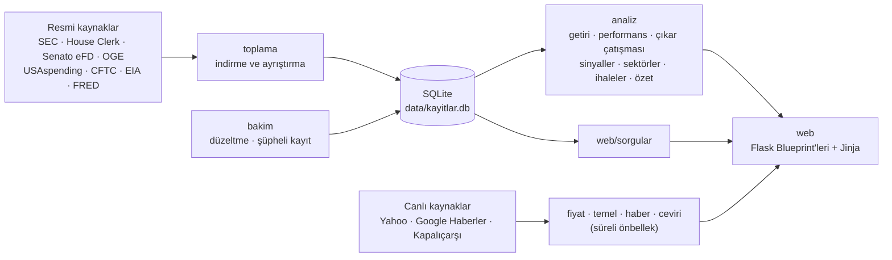

<div align="center">

# Piyasa Kaydı

**ABD'de kim hangi hisseyi aldı, kim sattı? Resmi bildirimlerden derlenen Türkçe kayıt.**

Kongre üyelerinin, Başkan ve Başkan Yardımcısının, şirket yöneticilerinin ve büyük fonların
bildirdiği hisse işlemlerini toplar; Türkçe, sade ve kaynağına bağlı olarak gösterir.


</div>

---

## İçindekiler

- [Neden?](#neden)
- [Özellikler](#özellikler)
- [Veri kaynakları](#veri-kaynakları)
- [Hızlı başlangıç](#hızlı-başlangıç)
- [Verinin güncel tutulması](#verinin-güncel-tutulması)
- [Komutlar](#komutlar)
- [Mimari](#mimari)
- [Proje yapısı](#proje-yapısı)
- [Testler](#testler)
- [Yöntem ve sınırlar](#yöntem-ve-sınırlar)
- [Yasal uyarı](#yasal-uyarı)

## Neden?

ABD'de siyasetçiler ve şirket yöneticileri yaptıkları hisse işlemlerini kanunen kamuya açıklamak
zorunda. Bu bildirimler ücretsizdir, ama İngilizce, dağınık, çoğu zaman PDF ya da XML biçimindedir
ve okumak uzmanlık ister.

Piyasa Kaydı bu bildirimleri her gün kendiliğinden toplar, temizler ve finans bilgisi olmayan
birinin de anlayabileceği şekilde Türkçe sunar. Her kaydın yanında resmi belgeye giden bağlantı
bulunur; site yorum yapmaz, kaydı gösterir.

## Özellikler

### Kayıtlar

| Bölüm | Ne gösterir |
|---|---|
| **Yatırım karşılaştırma** | Geçmişte (2006'dan bu yana herhangi bir ay) dolar, euro, altın, gümüş, petrol, BIST 100, S&P 500, Nasdaq, Bitcoin, Ethereum ya da istenen hisse/kripto ile yapılan tek seferlik veya aylık düzenli yatırımın bugünkü değeri; TL ya da dolar bazında, enflasyondan arındırılmış getiri (TÜFE / ABD CPI), yıllık ortalama ve en büyük düşüşle. Seçimler adreste durur, bağlantıyla paylaşılır |
| **Canlı** | Piyasa göstergeleri, Borsa İstanbul'da günün hareketi ve ABD yöneticileri, Kongre ve KAP'tan en yeni bildirimler tek akışta; 15 dakikada bir toplanır, sayfa dakikada bir yenilenir |
| **Siyasetçiler** | Temsilciler Meclisi ve Senato üyelerinin STOCK Act bildirimleri; parti, eyalet, komite üyelikleri, resmi fotoğraflar, tahmini portföy ve geç bildirimler |
| **Başkan ve Başkan Yardımcısı** | OGE yıllık mali durum bildirimlerinden ayıklanan hisse ve fon portföyü ile yıl içindeki işlemler |
| **Şirket yöneticileri** | SEC Form 4 bildirimlerinden yalnızca açık piyasa alım ve satımları; unvanlar Türkçe |
| **Fonlar** | Vanguard, BlackRock, Berkshire, Norveç Varlık Fonu gibi büyük kurumların 13F portföyleri ve çeyrekten çeyreğe değişimler |
| **Hisse sayfaları** | Şirketin ne iş yaptığı, anlık fiyat, temel rakamlar (piyasa değeri, F/K, son bilanço), analist hedef fiyatları, devlet sözleşmeleri, güncel Türkçe haberler ve o hissedeki bütün bildirimler |
| **Emtialar** | Altın, gümüş, platin, bakır ve Brent petrol: fiyat ve hacim, büyük fonların konumu, petrol stokları, Fed faiz kararları, vadeli piyasanın ve faiz piyasasının beklentisi, Kapalıçarşı altın ve gümüş fiyatları |
| **Borsa İstanbul** | Pay piyasasındaki 650 hissenin fiyatı ve KAP sektörü (BIST 100 / BIST 30 / sektör süzgeci), her şirketin sayfası (fiyat, rakamlar, aynı sektördeki şirketler); KAP'tan yöneticilerin ve büyük ortakların pay alım satım bildirimleri (kişi, görevi, adet, fiyat, tutar, işlem sonrası pay oranı), fonların eşik bildirimleri, şirketlerin kendi paylarını geri alımları, özel durum açıklamaları; hisseyi kimlerin tuttuğu (ortaklık yapısı, halka açıklık, yönetim kurulu, bağlı ortaklıklar) ve büyük ortakların sayfaları |
| **Kripto paralar** | İşlem hacmi yüksek bütün kripto paralar (yaklaşık 180); Türkçe profil, gerçek 24 saatlik fiyat değişimi, piyasa değeri ve arz; siyasetçilerin kripto işlemleri, kripto şirketlerinde yönetici işlemleri, Bitcoin/Ethereum fonu tutan bankalar, CME vadelilerinde kurumların konumu, korku ve açgözlülük endeksi, Bitcoin yarılanma sayacı |

### Analizler

- **Kim piyasayı yendi?** Siyasetçilerin aldığı hisselerin 90 gün sonra S&P 500'e göre durumu;
  hem işlem gününden hem de bildirimin yayımlandığı günden ölçülür.
- **Çıkar çatışması.** Bir üyenin, kendi komitesinin denetlediği sektörde yaptığı işlemler
  (SEC sanayi kodu ↔ komite yetki alanı).
- **Sektör haritası.** Siyasetçi ve yönetici işlemlerinin sektörlere göre net yönü.
- **Devlet sözleşmeleri.** Bir şirketin hissesi alındıktan sonra o şirkete verilen, olağan
  temposunun belirgin şekilde üstündeki federal sözleşmeler (USAspending.gov).
- **Sinyaller işe yarıyor mu?** Siyasetçi, yönetici ve küme alımlarının 30/90/180 gün sonraki
  getirisi; güven aralığı, t testi ve çoklu karşılaştırma (Holm) düzeltmesiyle.
- **Günlük özet.** Günün öne çıkan bildirimleri, haber diliyle ve kısa.

### Kullanım kolaylığı

- Hisse, BIST şirketi, kişi, fon, emtia ve kripto için tek arama kutusu; son aramalar hatırlanır.
- Yönetici işlemlerinde role göre süzgeç: üst yönetim (CEO, CFO, başkan), yönetim kurulu, büyük ortaklar.
- Rehberler: Form 4, 13F, STOCK Act, KAP pay alım satım bildirimi, pay geri alımı ve hisse oranları sade dille.
- Arama motorları için site haritası (`/sitemap.xml`) ve `robots.txt`.
- Karanlık ve aydınlık tema, telefona uygun görünüm.
- Teknik terimlerin yanında sade açıklamalar ("F/K: fiyat, hisse başına yıllık karın kaç katı").

## Veri kaynakları

| Kaynak | Veri | Sıklık |
|---|---|---|
| [TCMB](https://www.tcmb.gov.tr) · [FRED](https://fred.stlouisfed.org) | Türkiye ve ABD aylık tüketici fiyatları (enflasyon) | Günlük kontrol |
| [SEC EDGAR](https://www.sec.gov/edgar) | Form 4 yönetici işlemleri, 13F fon portföyleri, şirket sektörleri | 15 dakikada bir / çeyreklik |
| [House Clerk](https://disclosures-clerk.house.gov) | Temsilciler Meclisi işlem bildirimleri (PDF) | Günde 5 kez |
| [Senate eFD](https://efdsearch.senate.gov) | Senato işlem bildirimleri | Günde 5 kez |
| [OGE](https://www.oge.gov) | Başkan ve Başkan Yardımcısının mali durum bildirimleri | Yıllık |
| [congress-legislators](https://github.com/unitedstates/congress-legislators) | Üyeler, partiler, komiteler | Günlük |
| [USAspending.gov](https://www.usaspending.gov) | Federal sözleşmeler | Günlük |
| [CFTC](https://www.cftc.gov) · [EIA](https://www.eia.gov) · [FRED](https://fred.stlouisfed.org) | Fon konumları, petrol stokları, faizler | Haftalık / günlük |
| Yahoo Finance | Hisse ve emtia fiyatları, şirket rakamları, analist beklentileri | Canlı (önbellekli) |
| Google Haberler | Türkçe ve İngilizce haber başlıkları | Canlı (önbellekli) |
| [KAP](https://www.kap.org.tr) | Borsa İstanbul pay alım satım, geri alım ve özel durum bildirimleri, şirket listesi, sektörler ve ortaklık yapısı | 15 dakikada bir |
| Truncgil Finans | Kapalıçarşı altın ve gümüş fiyatları | Canlı (önbellekli) |
| [CoinGecko](https://www.coingecko.com) · alternative.me · mempool.space | Kripto fiyatları, korku endeksi, Bitcoin blok yüksekliği | Canlı (önbellekli) |

Yahoo Finance ve haber verileri ücretsiz kaynaklardan, kişisel ve deneysel kullanım için alınır.

## Hızlı başlangıç

Gereksinimler: Python 3.11+, Senato bildirimleri için Google Chrome.

```bash
git clone https://github.com/cemgokmen/piyasa-kaydi.git
cd piyasa-kaydi

python3 -m venv venv
source venv/bin/activate          # Windows: venv\Scripts\activate
pip install -r requirements.txt

# SEC, istek yapan herkesin kendini tanıtmasını ister
export SEC_USER_AGENT="PiyasaKaydi ad@ornek.com"

python -m piyasa veritabani       # tabloları oluşturur
python -m piyasa guncelle         # bütün veriyi indirir (ilk seferde uzun sürer)
python -m piyasa site             # http://127.0.0.1:5001
```

Yayın sürümü (gunicorn, sıkıştırma ve sayfa önbelleğiyle):

```bash
python -m piyasa yayin            # --kur ile Mac her açıldığında kendiliğinden başlar
```

## Verinin güncel tutulması

```bash
python -m piyasa zamanla          # macOS (launchd)
```

| Saat | Görev | Süre |
|---|---|---|
| 07:00 | **Tam güncelleme:** bildirimler, fiyatlar, fonlar, emtialar, şirket bilgileri, analizler | dakikalar |
| 12:00, 18:00, 21:00 ve 00:00 | **Hızlı güncelleme:** yeni Meclis, Senato ve fon bildirimleri (Form 4 ve KAP canlı güncellemede) | birkaç dakika |
| 15 dakikada bir | **Canlı güncelleme:** SEC'e gün içinde düşen Form 4'ler (son bildirimler akışı) ve KAP'ın o günkü bildirimleri; gece ve hafta sonu saatte bir | ~1 dakika |

- Bilgisayar o saatte kapalı ya da uykudaysa güncelleme, açıldığında kendiliğinden yapılır.
- İnternet bağlantısı gelene kadar beklenir; iki güncelleme aynı anda çalışmaz
  (canlı güncellemenin kendi kilidi vardır, uzun süren tam güncellemeyi beklemez).
- İnternet kotası için: BIST fiyatları yalnızca borsa açıkken 20 dakikada bir indirilir (bir yıllık geçmiş günde bir kez,
  gün içinde yalnızca son 5 gün), sitenin işçileri aynı veriyi tek kez indirip `data/bist_fiyatlari.json` üzerinden paylaşır.
  Sayfalar Cloudflare'de 2 dakika (API 30 saniye) tutulabilecek şekilde `s-maxage` başlığıyla gönderilir.
- `/canli` sayfası bütün kaynaklardan en yeni bildirimleri tek akışta gösterir ve açık kaldıkça dakikada bir yenilenir.
- Her adım ayrı çalışır; biri hata verirse diğerleri devam eder.
- Son güncelleme zamanı sitenin alt kısmında görünür.

## Komutlar

Bütün işler tek giriş noktasından yapılır: `python -m piyasa <komut>`
(tam liste için `python -m piyasa yardim`).

| Komut | Açıklama |
|---|---|
| `site` / `yayin` | Geliştirme sunucusu / gunicorn ile yayın |
| `guncelle [--hizli]` | Bütün veriyi ya da yalnızca yeni bildirimleri günceller |
| `zamanla [--saat 6:15] [--kaldir]` | Otomatik güncellemeyi kurar ya da kaldırır |
| `form4` | Son 90 günün eksik Form 4 günlerini indirir |
| `kongre [yıl …]` · `senato [yıl …]` | Meclis ve Senato bildirimleri |
| `fon` · `cusip` | 13F portföyleri ve CUSIP → hisse kodu eşlemesi |
| `kap [--gun 90]` | Borsa İstanbul: KAP bildirimleri ve ayrıntıları (geçmişe dönük doldurma için `--gun`) |
| `emtia` · `fiyatlar` | Emtia verileri ve hisse fiyat geçmişi |
| `kripto [--tara]` | Bitcoin/Ether vadelilerinde fon konumları; `--tara` eski Kongre bildirimlerinde kripto işlemlerini arar |
| `sirketler` · `profiller` · `ihaleler` | Sektörler ve komiteler, şirket tanımları, devlet sözleşmeleri |
| `yurutme` · `yurutme-portfoy` | Başkan ve Başkan Yardımcısının bildirimleri |
| `analiz` | İşlem sonrası getiriler |
| `duzelt` · `supheli` | Veri düzeltme ve şüpheli kayıtların işaretlenmesi |

## Mimari



**Katman kuralları** (`tests/test_mimari.py` her test çalıştırmasında denetler):

- `toplama` yalnızca veri indirir ve yazar; `bakim` yazılan veriyi düzeltir; `analiz` ve `web` yalnızca okur.
- Bağımlılık tek yönlüdür: `analiz`, `web` ve `emtia`; `toplama` ve `bakim`'ı içe aktarmaz.
- Alan kuralları (yasal süreler, eşikler, ortak SQL koşulları) `kurallar.py`'de, Türkçe
  biçimlendirme `bicim.py`'de tek yerde durur.

**Performans:**

- Canlı veriler `@sureli` önbelleğiyle tutulur; boş ya da hatalı cevaplar önbelleğe alınmaz.
- Hazır sayfalar 2 dakika saklanır; aynı sayfayı aynı anda yalnızca bir istek hazırlar.
- Yavaş bölümler (haberler, şirket rakamları) sayfa açıldıktan sonra ayrıca yüklenir.

## Proje yapısı

```
piyasa/
├── __main__.py          Komut satırı
├── ayarlar.py           Dosya yolları, SEC_USER_AGENT
├── veritabani.py        SQLite şeması
├── kurallar.py          Yasal süreler, eşikler, partiler, ortak SQL koşulları
├── bicim.py             Tutar, yüzde, tarih, kişi adı ve unvanların Türkçe gösterimi
├── zamanlama.py         Otomatik güncelleme (launchd)
├── fiyat.py             Anlık ve geçmiş fiyatlar
├── temel.py             Şirket rakamları ve analist beklentileri
├── sirket_profili.py    "Şirket ne iş yapıyor?" metinleri
├── hisse_haberleri.py   Hisse haberleri (çevirili)
├── ceviri.py            Ücretsiz çeviri, özel adları koruyarak
├── toplama/             Form 4, Meclis, Senato, 13F, OGE, USAspending, CFTC/EIA/FRED
├── bakim/               Veri düzeltme, şüpheli kayıtlar
├── analiz/              Getiri, performans, çıkar çatışması, sinyaller, sektör haritası, ihaleler, özet
├── emtia/               Emtia tanımları, sorgular, haberler, Kapalıçarşı, piyasa beklentileri
├── kripto/              Coin profilleri, CoinGecko verisi, kripto şirketleri, CFTC ve 13F sorguları
├── bist/                BIST 100 fiyatları ve KAP bildirim sorguları
├── veri/                Elle hazırlanmış şirket ve endüstri tanımları
└── web/                 Flask uygulaması, sorgular, şablonlar, CSS ve JavaScript
tests/                   pytest ve Selenium testleri
data/                    Fon listesi; veritabanı yerelde oluşturulur
```

## Testler

```bash
pip install -r requirements-dev.txt
python -m pytest            # birim, sayfa ve tarayıcı testleri
ruff check .                # kod denetimi
```

Testler gerçek veritabanına ve internete dokunmaz: geçici bir örnek veritabanı kurulur, fiyat,
haber ve çeviri servisleri sahte veriyle değiştirilir.

| Dosya | Kapsam |
|---|---|
| `test_sayfalar.py` | Her sayfa, 404'ler ve sitedeki bütün iç bağlantıların gezilmesi |
| `test_tarayici.py` | Başsız Chrome'da arama, menüler, sıralama, grafikler, telefon görünümü (Chrome yoksa atlanır) |
| `test_bicim.py` | Tutar, tarih, ad ve unvan biçimleri; bildirim ayrıştırıcıları; haber seçimi |
| `test_analiz.py` | Getiri, istatistik ve Holm düzeltmesi, sektör eşlemeleri |
| `test_yurutme.py` | OGE bildirimleri, şirket rakamları |
| `test_mimari.py` | Katmanlar arası bağımlılık kuralları |

## Yöntem ve sınırlar

- Kongre bildirimlerinde tam tutar değil **aralık** yazar (ör. 1.001–15.000 $); site tutarları
  "en az – en çok" olarak gösterir.
- Yönetici işlemlerinde yalnızca **açık piyasa** alım ve satımları sayılır; maaş olarak verilen
  hisseler, opsiyon kullanımları ve vergi kesintileri yatırım kararı olmadığı için dışarıda kalır.
- Elle doldurulup taranarak gönderilen Kongre bildirimleri okunamadığı için listede yoktur.
- Fiyatı imkansız düzeyde olan ya da tarihleri tutarsız kayıtlar yazım hatası şüphesiyle gizlenir.
- Ayrıntılı yöntem sitenin **Yöntem** sayfasındadır.

## Yasal uyarı

Piyasa Kaydı yalnızca kamuya açık resmi bildirimleri derler. **Yatırım tavsiyesi değildir.**
Bir yöneticinin ya da siyasetçinin bir hisseyi alması, o hissenin değer kazanacağı anlamına gelmez.
